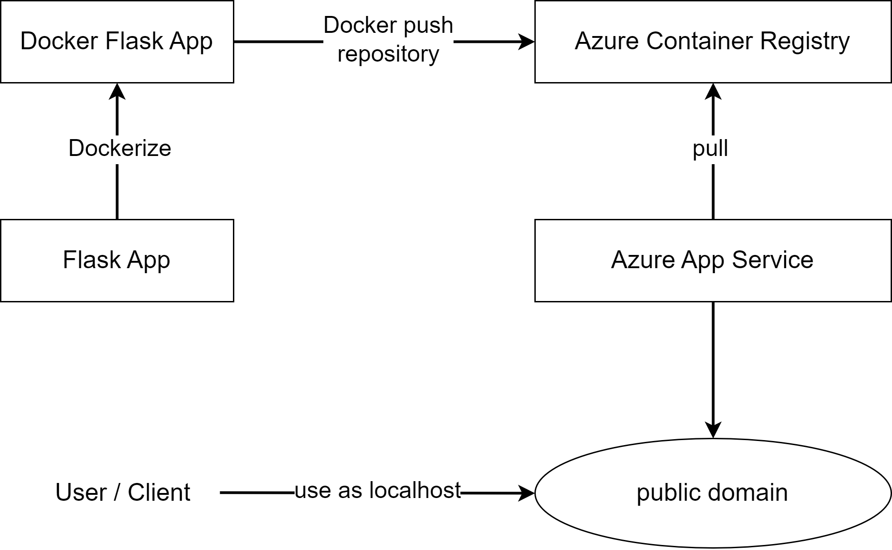

# Movie Server

## Table of contents

- [Movie Server](#movie-server)
  - [Table of contents](#table-of-contents)
  - [Introduction](#introduction)
  - [Features](#features)
    - [Movie](#movie)
    - [User](#user)
    - [User Movie](#user-movie)
    - [Recommend Movie](#recommend-movie)
  - [Getting Started](#getting-started)
    - [Prerequisites](#prerequisites)
    - [Installation](#installation)
  - [Usage](#usage)
  - [API Endpoints](#api-endpoints)
    - [Movie API](#movie-api)
    - [User API](#user-api)
    - [User Movie API](#user-movie-api)
    - [Recommend Movie API](#recommend-movie-api)
  - [Guidelines: Deploy server to Azure](#guidelines-deploy-server-to-azure)
    - [Architecture system](#architecture-system)
    - [Prerequisites Deploy](#prerequisites-deploy)
    - [Guidelines](#guidelines)
    - [Resources](#resources)
  - [Contributing](#contributing)
  - [License](#license)

## Introduction

- Movie Server is a web application built using Flask, designed to provide a simple and efficient way to manage and serve movie information. The application includes a recommendation system that suggests movies to users based on their preferences.

## Features

### Movie

1. Get list movies
2. Get movie by id
3. Get movies by genre
4. Create new movie
5. Edit movie
6. Delete movie

### User

1. Get list user
2. Get user by id
3. Create new user
4. Edit user
5. Delete user

### User Movie

1. Get list user_movie
2. Get user_movie by id user
3. Get user_movie by id user and id movie
4. Create new user_movie
5. Edit user_movie
6. Delete user_movie

### Recommend Movie

1. Recommend movie for new user
2. Recommend movie for existing user

## Getting Started

### Prerequisites

- Python version: 3.10.6
- OS: Window, Linux

### Installation

1. Clone the respository:

```bash
git clone https://github.com/AmosIvor/movie_server.git
```

2. Navigate to the project directory:

```bash
cd movie_server
```

3. Create a virtual environment:

```bash
python -m venv venv
```

4. Activate virtual environment you just created

- On Windows:

```bash
source venv/Scripts/activate
```

- On macOS and Linux:

```bash
source venv/bin/activate
```

5. Install dependencies:

```bash
pip install -r requirements.txt
```

## Usage

1. Run the Flask app:

```bash
python app.py
```

1. Access the application in your browser at [localhost:5000](http://127.0.0.1:5000)

## API Endpoints

- URL: [localhost:5000](http://127.0.0.1:5000)

### Movie API

1. Get list movies:

- URL: `URL/movies`
- Method: GET

2. Get movie by id:

- URL: `URL/movies/:idMovie`
- Method: GET
- Params: `idMovie`

3. Get movies by genre:

- URL: `URL/movies/:genre`
- Method: GET
- Params: `genre`

4. Create new movie:

- URL: `URL/movies`
- Method: POST
- Body:

```json
{
  "movieTitle": "movie-title",
  "movieGenre": "Sci-fi|Action",
  "movieImage": "https://i.ebayimg.com/images/g/CwEAAOSwv4xf5cdv/s-l1200.jpg"
}
```

5. Edit movie

- URL: `URL/movies/:idMovie`
- Method: PUT
- Params: `idMovie`
- Body:

```json
{
  "movieTitle": "movie-title",
  "movieGenre": "Sci-fi|Action",
  "movieImage": "https://i.ebayimg.com/images/g/CwEAAOSwv4xf5cdv/s-l1200.jpg"
}
```

6. Delete movie

- URL: `URL/movies/:idMovie`
- Method: DELETE
- Params: `idMovie`

### User API

1. Get list user

- URL: `URL/users`
- Method: GET

2. Get user by id

- URL: `URL/users/:idUser`
- Method: GET
- Params: `idUser`

3. Create new user

- URL: `URL/users`
- Method: POST
- Body:

```json
{
  "username": "doan1",
  "email": "doan1@gmail.com",
  "password": "123456"
}
```

4. Edit user

- URL: `URL/users/:idUser`
- Method: PUT
- Params: `idUser`
- Body:

```json
{
  "username": "doan1",
  "email": "doan1@gmail.com",
  "password": "123456"
}
```

5. Delete user

- URL: `URL/users/:idUser`
- Method: DELETE
- Params: `idUser`

### User Movie API

1. Get list user_movie

- URL: `URL/user_movies`
- Method: GET

2. Get user_movie by id user

- URL: `URL/user_movies/:idUser`
- Method: GET
- Params: `idUser`

3. Get user_movie by id user and id movie

- URL: `URL/user_movies/:idUser/:idMovie`
- Method: GET
- Params: `idUser` and `idMovie`

4. Create new user_movie

- URL: `URL/user_movies`
- Method: POST
- Body:

```json
{
  "userId": 4,
  "movieId": 21,
  "rating": 4.2,
  "isFavorited": true,
  "isWatched": true
}
```

5. Edit user_movie

- URL: `URL/user_movies/:idUser/:idMovie`
- Method: PUT
- Params: `idUser` and `idMovie`

```json
{
  "isFavorited": false
}
```

6. Delete user_movie

- URL: `URL/user_movies/:idUser`
- Method: DELETE
- Params: `idUser`

### Recommend Movie API

1. Recommend movie for new user

- URL: `URL/predict_new_user`
- Method: POST
- Body:

```json
{
  "genres": "Action,Thriller"
}
```

2. Recommend movie for existing user

- URL: `URL/predict`
- Method: POST
- Body:

```json
{
  "userId": 1
}
```

## Guidelines: Deploy server to Azure

- Purpose: You can change access server from localhost (just you can access) to default domain, that everyone can access (default domain is provided by azure web app)

### Architecture system



### Prerequisites Deploy

- Docker 20.10.24
- Azure Account

### Guidelines

- In order to deploy the Movie server on Microsoft Azure, you can follow these guidelines:

Step 1: Dockerize Flask App

```bash
docker build -t [images]:tag
```

Step 2: Create Azure Container Register in Âuzre, name registry is image that omit `.azurecr.io`

Step 3: Login server azure by command line:

```bash
docker login [login_server]
```

- Example: `docker login movierecommendationapi.azurecr.io`

Step 4: You have to fill in `username` and `password`. It is not `username` and `password` you login in Azure. Specifically, it is `username` and `passowrd` of Azure Container Registry

Step 5: Push repository to Azure Container Registry

```bash
docker push [images]:tag
```

- After that, you can check repository in tab `Repositories` of you Azure Container Registry

Step 6: Create Azure App Service with integrate repository of Azure Container Registry

Step 7: Run server by default domain in tab: `Overview`, wait a minute ...

Step 8: You can use this public server as localhost to call api and anything you want

### Resources

[Flask Documentation](https://flask.palletsprojects.com/en/3.0.x/tutorial/)
[Docker Documentation](https://docs.docker.com/get-started/)
[Azure App Service Documentation](https://learn.microsoft.com/en-us/azure/app-service/)
[Azure Container Registry Documentation](https://learn.microsoft.com/en-us/azure/container-registry/)

## Contributing

Feel free to contribute to the project. Follow these steps

1. Fork the repository
2. Create a new branch: `git checkout -b feature/[your-feature-name]`
3. Commit your changes: `git commit -m 'Add feature ...'`
4. Push to the branch: `git push origin feature/[your-feature-name]`
5. Submit a pull request

## License

This expanded introduction provides more context about the movie server, including information about the integrated recommendation system. Make sure to update any placeholder URLs, usernames, and project-specific details as needed.
